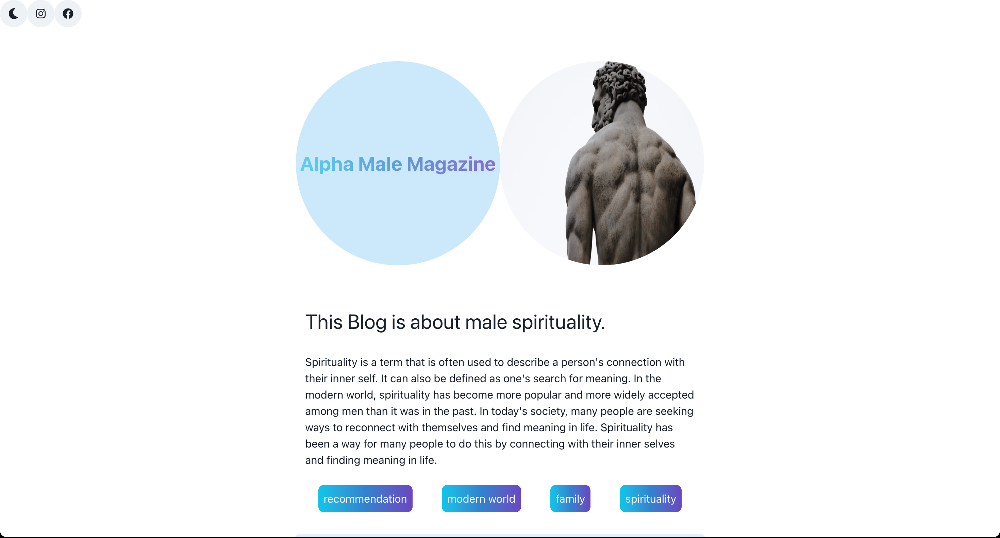

# Alpha Male Magazine - A Modern Men's Lifestyle Platform



## Project Overview
Alpha Male Magazine is a dynamic web platform focused on men's lifestyle content, built during the WBS Coding School Bootcamp. The project delivers curated articles and content about fitness, personal development, and lifestyle topics.

## Live Demo
The project is deployed and can be viewed at [https://alpha-male-magazine.netlify.app/](https://alpha-male-magazine.netlify.app/)

## Features
- Dynamic article feed
- Content categorization by tags
- Responsive design for all devices
- Newsletter subscription
- Modern and clean user interface

## Technologies Used
- React.js
- Chakra UI
- JavaScript ES6+
- Create React App
- CSS3
- Contentful CMS

## Getting Started

### Prerequisites
- Node.js
- npm
- Contentful account for content management

### Installation
1. Clone the repository
   ```bash
   git clone https://github.com/yourusername/alpha-male-magazine.git
   ```
2. Install dependencies
   ```bash
   npm install
   ```
3. Start the development server
   ```bash
   npm start
   ```
   The application will open at [http://localhost:3000](http://localhost:3000)

## Project Structure
```bash
alpha-male-magazine/
├── src/
│ ├── components/
│ ├── contentful/
│ └── img/
├── public/
└── README.md
```

## Learning Outcomes
- Building responsive React applications
- Working with Chakra UI components
- Implementing content management systems
- Creating modern user interfaces
- Collaborative development practices

## Contact
- GitHub: [@eikemx](https://github.com/eikemx)
- LinkedIn: [Eike Merx](https://www.linkedin.com/in/eike-merx-50b111216/)
- XING: [Eike Merx](https://www.xing.com/profile/Eike_Merx/web_profiles)

## Acknowledgments
- WBS Coding School
- [Contentful](https://app.contentful.com/) for providing the CMS platform
- Project collaborator: tognut86

---
*This project was created as part of the WBS Coding School Bootcamp curriculum.*
